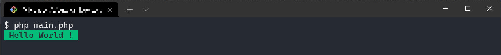

# Rainbox-console

> No dependencies, only PHP, only **1.1 Kb** and very easy to use 🚀

## Requirements

- PHP >= 7.1.0

Yeah, that's all you need. Impressive isn't it ?

## Installation

```bash
composer require mranyx/rainbow-console
```

## Usage

```php
require_once __DIR__ . "/path/to/autoload.php";

use RainbowConsole\ColorConsole;

echo ColorConsole::color("Hello World !", ColorConsole::GREEN, true);
```

And here is the result



> For more details about the result, you can check the `example/main.php` file and run it.

## Parameters

name | type | description
--- | --- | ---
$content | string | This is the text that will be prompted in the console.
$color | int | This is variable that is used to specify the color of the text/background.
$hasBackground | bool | If true, the text will have a background with the right color. If false, the text will appear without the background.

## Colors

There are currently 8 colors available : 

- Black
- Red
- Green
- Brown
- Blue
- Magenta
- Cyan
- Lightgray

All these colors are constants so you cann access them using `ColorConsole::color_name`

> The color name must be in upper case (Because it's the constant convention).

## Important

Each color can be use without or without the background except the color black. It can not be displayed with a background. It's only available with text only.